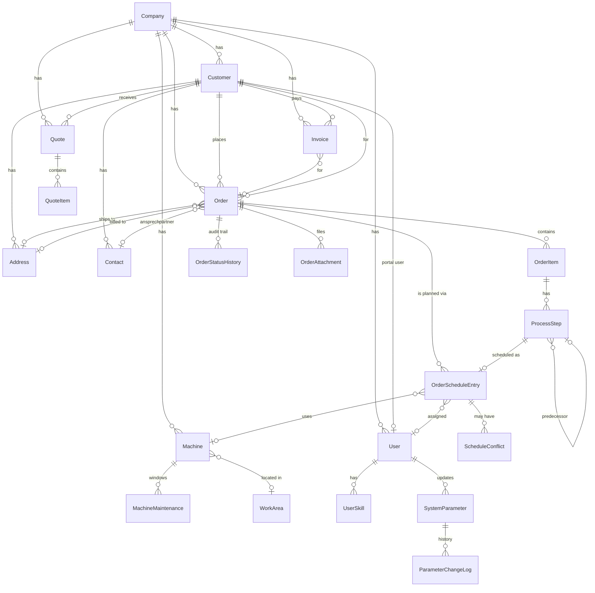

# Datenmodell — Phase 1 (ERP-Erweiterung)

> Status: Phase 1 abgeschlossen. CRM, Auftragsverwaltung, Maschinen-Park und CEO-editierbare System-Parameter im Schema. Folgende Phasen (CRM-UI, Auto-Scheduler, Offerten/Rechnungen, …) bauen auf diesem Modell auf.

## ER-Übersicht (Mermaid)

## Lifecycle pro Entität

| Modell | Zustände | Übergang |
|---|---|---|
| `Customer` | aktiv → archiviert → gelöscht | `archivedAt`/`deletedAt` (Soft-Delete für revDSG) |
| `Order` | DRAFT → CONFIRMED → IN_PROGRESS → COMPLETED → DELIVERED → INVOICED + ON_HOLD/CANCELLED | dedizierte Server Actions, jeweils mit `OrderStatusHistory` |
| `Quote` | DRAFT → SENT → ACCEPTED/REJECTED/EXPIRED | bei `SENT` wird `parameterSnapshot` eingefroren |
| `Invoice` | DRAFT → SENT → PAID/OVERDUE/CANCELLED | bei `markPaid` wird `paidAt` gesetzt |
| `Machine` | aktiv → archiviert → gelöscht | `archivedAt`/`deletedAt` |
| `OrderScheduleEntry` | (keine eigenen Stati) | `isLocked=true` schützt vor Auto-Scheduler |
| `ProcessStep` | PENDING → SCHEDULED → IN_PROGRESS → DONE/BLOCKED/CANCELLED | gesteuert durch Workshop-View + Auto-Scheduler |
| `SystemParameter` | änderbar mit Audit-Trail | Pflicht-Begründung, jeder Change in `ParameterChangeLog` |

## Snapshot-Regeln (kritisch für Datenintegrität)

**Order.parameterSnapshot** und **Quote.parameterSnapshot** speichern beim Statuswechsel `DRAFT → CONFIRMED` (bzw. `DRAFT → SENT` bei Quote) eine **eingefrorene Kopie** aller berechnungsrelevanten Parameter.

| Auftragsstatus | Berechnungsmodus |
|---|---|
| `DRAFT` | LIVE — liest aktuelle Parameter beim Öffnen |
| `CONFIRMED`, `IN_PROGRESS`, `ON_HOLD`, `COMPLETED`, `DELIVERED`, `INVOICED` | SNAPSHOT — Werte aus `parameterSnapshot` |
| `Quote.SENT` und später | SNAPSHOT |

Der Helper `getCalcContext(prisma, order)` in `lib/domain/calculation/` (Phase 3) entscheidet anhand des Status, welche Parameter-Map an die reinen Berechnungs-Funktionen übergeben wird. Re-Kalkulation eines bereits eingefrorenen Auftrags ist nur durch `ADMIN` über expliziten Button möglich (mit Bestätigungs-Dialog + Diff-Anzeige + neuem Snapshot).

Welche Keys fliessen in den Snapshot? Siehe `snapshotKeys()` in `lib/domain/parameters/store.ts`:
- `process.*` (Standardzeiten + Pauschalen)
- `curing.*` (Aushärtungs-Profile)
- `drying.*` (Trocknung)
- `material.*` (Multiplikatoren)
- `complexity.*` (Multiplikatoren)
- `pricing.*` (Stundensätze + Zuschläge)
- `tax.*` (MwSt-Sätze)

## Konflikte mit dem bestehenden Personal-Planungs-Modul

| Bestehend (Personalplanung) | Neu (ERP-Auftragsplanung) |
|---|---|
| `ScheduleEntry` (Mitarbeiter × Tag, mit `workAreaId`) | `OrderScheduleEntry` (ProcessStep × Slot, mit `machineId` + `assignedUserId`) |
| `WorkArea` (Funktionsbereich, z. B. "Sandstrahlen") | `Machine` (konkrete Anlage in einem Bereich, mit Specs) |
| `WorkArea.minEmployeesPerDay/maxEmployeesPerDay` | `Machine.chargeCapacityM2`, `Machine.workingHours` |

→ Beide Welten existieren parallel. **Personalplanung** sagt "Hans arbeitet morgen in Sandstrahlen", **Auftragsplanung** sagt "ProcessStep #42 (BLAST_SA25) wird morgen 09:00–11:30 auf Strahlkabine 1 mit Hans bearbeitet". Phase 4 (Auto-Scheduler) verzahnt sie über `User.skills` + Schichtkalender.

## RBAC (UserRole)

| Rolle | Permissions (Auswahl) |
|---|---|
| `ADMIN` | alles, inkl. **Parameter-Edit**, Re-Kalkulation, Stundensätze, MwSt |
| `PLANNER` | Aufträge / Planung / Kunden CRUD, Parameter **read-only** |
| `EMPLOYEE` | Eigene Schichten, Aufträge read-only |
| `CUSTOMER_PORTAL` | nur eigene Daten (Phase 7, schema-ready) |

Legacy `SECRETARY` + `TEAM_LEAD` wurden in der Migration auf `PLANNER` zusammengeführt; die Enum-Werte bleiben aus Postgres-Kompatibilität, der Code mappt sie defensiv (`effectiveRole()` in `lib/permissions.ts`).

## Audit-Log

Bestehendes `AuditLog`-Modell wird wiederverwendet. Neue Werte für `AuditAction`:
- `STATUS_CHANGE` — Order/Quote/Invoice
- `PARAMETER_UPDATE` — System-Parameter-Edit
- `INVOICE_PAID`
- `ORDER_CONFIRMED` / `ORDER_CANCELLED`

## Migrations-Stand

| Migration | Zweck |
|---|---|
| `20260501095618_init` | Initial-Schema (Personalplanung) |
| `20260501110352_add_lifecycle_fields` | `archivedAt` / `deletedAt` auf Employee/Absence/Holiday/AbsenceType |
| `20260501195928_add_work_areas` | `WorkArea` + `EmployeeWorkArea` |
| `20260501201710_add_schedule_entry_area` | `ScheduleEntry.workAreaId` |
| `20260504135112_add_area_capacity` | `WorkArea.maxEmployeesPerDay` |
| `20260504141253_add_area_min` | `WorkArea.minEmployeesPerDay` |
| _(via `db push` Phase 1)_ | ERP-Erweiterung: Customer, Order, Machine, Parameter, … |

> Die ERP-Erweiterung wurde mit `prisma db push` deployed (nicht-interaktive Umgebung). Eine reguläre Migration-Datei wird beim nächsten `prisma migrate dev` aus dem User-Terminal erstellt.
